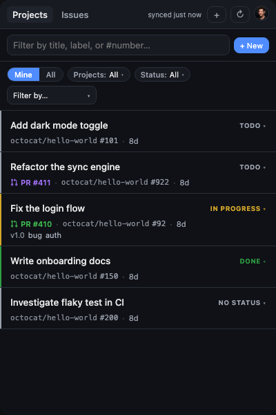

# GH Tasks

A menu-bar issue dashboard that treats GitHub Issues as your personal task list.
Define **Sources** — each a `(repo, GitHub search query)` pair — and the app
surfaces every matching issue in one unified list. Works across multiple repos
so one app can drive your personal todos, work tasks, and PR review queue.

- macOS menu bar + Windows system tray (Tauri 2)
- GitHub Device Flow auth — no client secret shipped, token in OS keychain
- Multi-repo Sources with per-Source enable/notify/color
- Native filters via GitHub search syntax (including the new issue types)
- Create / complete / open issues inline
- **Awaiting my response** — an amber indicator + dedicated tab for issues/PRs
  that need your reply (@-mention, review requested, re-review), with desktop
  notifications
- **Linked-PR indicators** — see the pull request that closes an issue at a
  glance, colored by state (open / merged / closed), one click to open it
- **Milestone pills** — surface the milestone an issue belongs to
- **Row density** — Compact / Default / Comfortable / Spacious, in Settings
- Desktop notifications when new matching issues appear
- Mobile (iOS/Android) via Tauri mobile — planned
- Real-time via a GitHub App webhook relay — planned

## Awaiting my response

Issues and PRs where the ball is in your court get a warm-amber **gutter dot**
and a **reason badge** telling you *why* — you were **@-mentioned**, a **review
was requested** from you, or a PR you reviewed needs a **re-review**. The cue
appears inline on the Projects/Issues rows and clears once you open the item.

A dedicated **Awaiting** tab (with a count badge) aggregates everything needing
your response across all your repos — even ones you haven't added as a Source —
and a desktop notification fires when a new item lands.


Detection uses cheap GitHub search filters (`mentions:@me`,
`review-requested:@me`) run globally each refresh; "seen" state is tracked
per-item so you're not re-pinged for something you've already looked at.

## Row layout & density

Each row leads with the title and a color-coded **status** tag, then a metadata
line (linked PR · repo · number · time), then labels and milestone. A thin
status-color stripe runs down the left edge.

Pick the spacing that fits your board in **Settings → General → Row density**:

| Preset | Layout |
|---|---|
| Compact | 2 rows; labels fold inline, truncated. Most items per screen. |
| Default | 3 rows; the metadata line never wraps, labels on their own line. |
| Comfortable | 3 rows, same structure with larger type and more padding. |
| Spacious | 3 rows, largest type and most spacing. |

Window size can be set to **Large** or **Wide** in the same panel.



See [docs/design/](docs/design/) for the Compact / Comfortable / Spacious renders
and the design rationale.

## Linked PRs & milestones

Every issue row shows the pull request(s) **development-linked** to it — the
`Closes #123` / sidebar relationship that auto-closes the issue on merge — as
colored `PR #N` text (green = open, purple = merged, red = closed; draft PRs are
muted). If the issue belongs to a milestone, a milestone pill sits on the labels
line. Click either to open it in your browser. Both appear on the **Projects**
and **Issues** tabs.

On the Projects tab the linked-PR/milestone data piggybacks on the existing
Projects v2 GraphQL query (`closedByPullRequestsReferences` + `milestone`) — no
extra round trip. The Issues tab fills it in with a single batched GraphQL query
after the REST issue search, since REST exposes no linked-PR field.

## Develop

Requirements: Node 20+, Rust 1.77+, plus the Tauri system deps for your OS:
<https://tauri.app/start/prerequisites/>.

```sh
npm install
npm run tauri dev
```

Before building installers for the first time, set your OAuth client id:

```sh
export GHTASKS_CLIENT_ID=Iv1.xxxxxxxxxxxxxxxx
```

(Any public GitHub App or OAuth app's client id works — device flow is
designed to be safe to embed.)

## Build

```sh
npm run tauri build
```

Artifacts land in `src-tauri/target/release/bundle/`.

## Project layout

```
src/                    Svelte frontend
  lib/api.ts            Typed wrapper around Tauri commands
  lib/stores.ts         Svelte stores (auth, sources, issues)
  lib/components/       UI components
    LinkedBadges.svelte Linked-PR + milestone badges (shared by both lists)
src-tauri/src/
  auth.rs               Device flow + keychain
  github.rs             GitHub REST client + Issue/LinkedPr/Milestone shapes
  projects.rs           Projects v2 GraphQL + batched linked-PR enrichment
  sources.rs            Source + Settings persistence
  commands.rs           Tauri command surface
  tray.rs               Menu bar / system tray
  notify.rs             Native notifications
  lib.rs                App entry + plugin wiring
```
