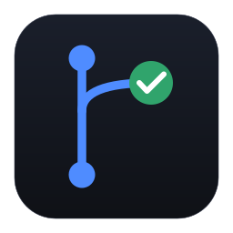
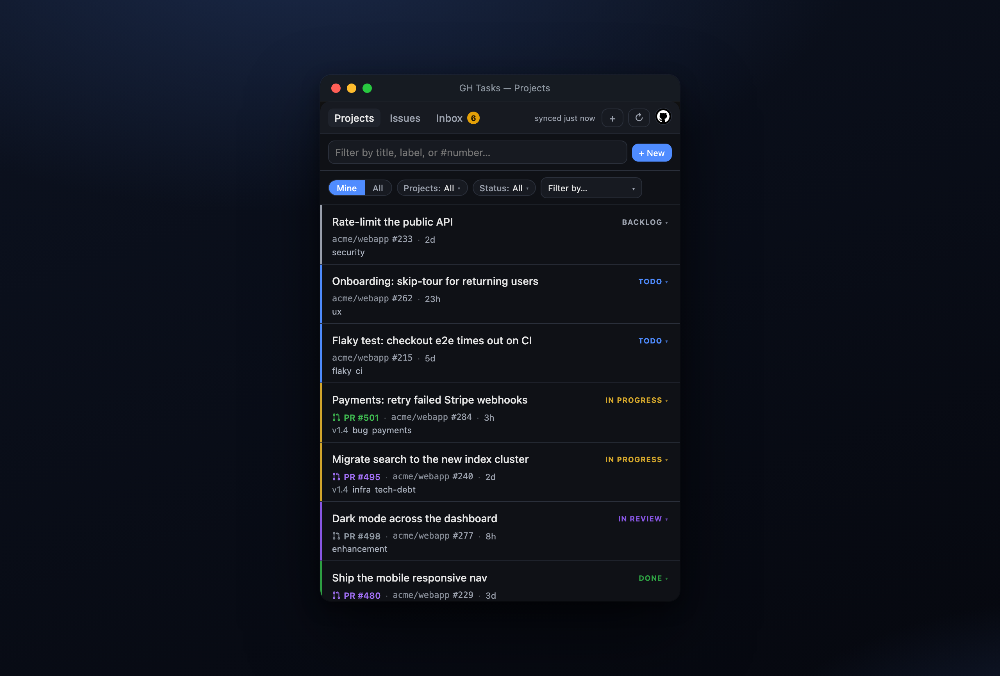
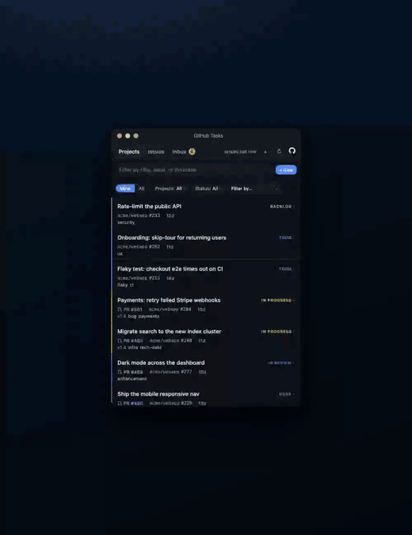
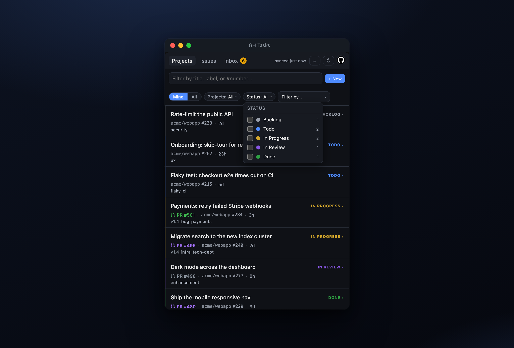
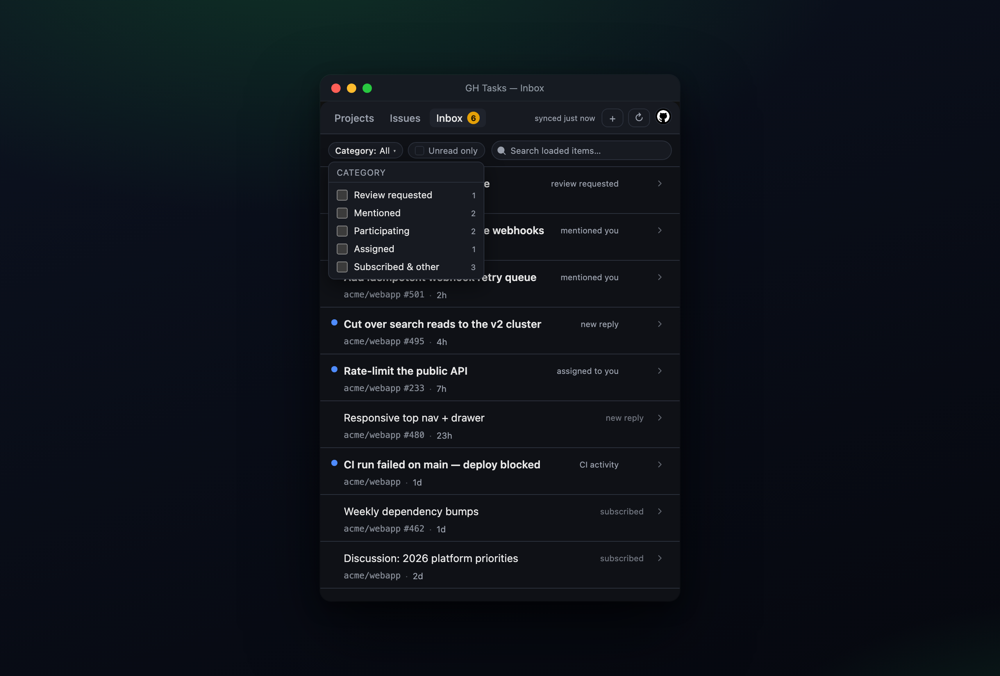
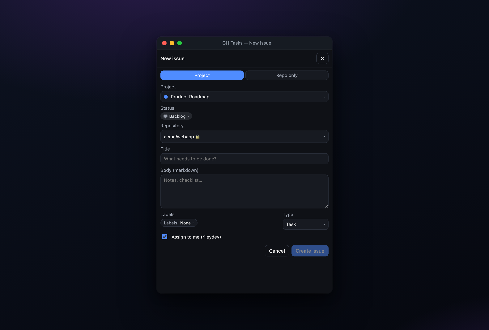
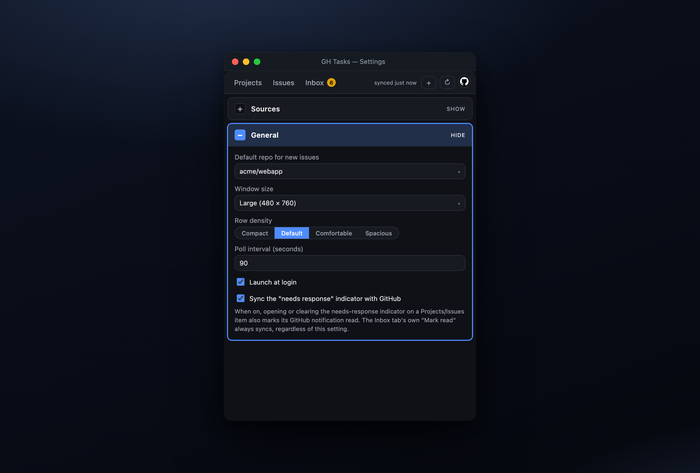

<div align="center">



# GH Tasks

### Your GitHub issues, one keystroke away.

A fast, keyboard-friendly menu-bar app that turns GitHub **Issues**, **Projects**, and **notifications** into a single task list — anchored to your tray, open in a tap, gone when you're done. No browser tab, no context switch.

[**⬇︎ Download for macOS · Windows · Linux**](https://github.com/cgaspard/ghtasks/releases/latest) &nbsp;·&nbsp; [What's new](release_notes/v0.5.0.md)

<br />



</div>

<br />

## Why GH Tasks

You live in the terminal and the editor. Your work lives in GitHub. Between them is a browser tab you keep reopening to check *what's assigned to me, what needs my review, who @-mentioned me.* GH Tasks collapses that loop into a menu-bar icon:

- **Instant.** Click the tray icon (or hit your shortcut) and a compact window snaps open right under it. Cold launch paints from disk cache in a blink; a fresh sync runs underneath.
- **Unified.** One list spans every repo and Projects v2 board you add — personal todos, work tickets, and your review queue, side by side.
- **Keyboard-first.** Filter by typing. `⌘,` for settings. Everything's a keystroke; nothing needs the mouse.
- **Quiet until it matters.** A mirror of your GitHub notifications inbox, with desktop pings only for the things that actually need *you* — mentions, review requests, replies.

<br />

<div align="center">
<a href="docs/marketing/video/demo.mp4">
  
</a>

<em>A 15-second tour — Projects → status filters → Issues → the notifications Inbox.<br/>(<a href="docs/marketing/video/demo.mp4">watch the crisper MP4 →</a>)</em>
</div>

<br />

## Highlights

### One board, every repo

Add a **Source** — a Projects v2 board or a `(repo, GitHub search query)` pair — and its items flow into one keyboard-navigable list. Status pills, priorities, labels, milestones, and a color stripe per row. Filter by status with checkboxes, by source, by any custom single-select field, or just start typing a title or `#number`.

<div align="center">

</div>

### The notifications inbox that lives where you work

A faithful mirror of **github.com/notifications** — review requests, mentions, replies, assignments, CI, subscriptions — read and unread, with infinite scroll and search. Filter by category with checkboxes (Review requested · Mentioned · Participating · Assigned · Subscribed & other) and flip **Unread only** to cut to the chase. Click through to the item in-app or on GitHub; marking read syncs straight back to GitHub.

<div align="center">

</div>

### Linked PRs & milestones at a glance

Every issue row shows the pull request **development-linked** to it — the `Closes #123` relationship that auto-closes on merge — as colored `PR #N` text (green = open, purple = merged, red = closed; drafts muted). Milestones ride along as pills. One click opens either on GitHub.

### Create without leaving

Spin up a new issue — attach it to a project and set its status, pick the repo, labels, and issue type, assign it to yourself — from a modal that never leaves the menu bar.

<div align="center">

&nbsp;

</div>

<br />

## Install

Grab the latest signed build from the [**releases page**](https://github.com/cgaspard/ghtasks/releases/latest):

| Platform | File |
|---|---|
| **macOS** (Apple Silicon + Intel) | `GH.Tasks_universal.dmg` — signed & notarized, no Gatekeeper prompt |
| **Windows** | `GH.Tasks_x64-setup.exe` or `GH.Tasks_x64_en-US.msi` |
| **Linux** | `GH.Tasks_amd64.AppImage`, `.deb`, or `.rpm` |

Sign in once with GitHub's **device flow** — a code you paste at `github.com/login/device`. No client secret, no password, no backend server. Your token lives in the OS keychain.

**Scopes requested:** `repo read:user read:org notifications project`. `read:org` is what lets the app see org-owned Projects; if an org uses SSO, authorize the token for it after signing in.

<br />

## How it works

- **Shell:** [Tauri 2](https://tauri.app) — a Rust backend with a WebView front end. Menu-bar-only (no Dock icon on macOS).
- **Front end:** Svelte 5 + TypeScript + Vite.
- **Data:** GitHub GraphQL (Projects v2) + REST (issue search, comments, notifications).
- **Auth:** OAuth device flow; token in `keyring`.
- **Refresh:** a 90s auto-poll plus a manual ↻, with additive reconciliation so streamed pages never flicker the list.

For the full architecture, the refresh-loop mental model, and hard-won performance notes, see [AGENTS.md](AGENTS.md).

<br />

## Develop

Requirements: Node 20+, Rust 1.77+, and the [Tauri system deps](https://tauri.app/start/prerequisites/) for your OS.

```sh
npm install
npm run tauri dev
```

Set your OAuth client id before the first build (any public OAuth/GitHub App client id works — device flow is safe to embed):

```sh
export GHTASKS_CLIENT_ID=Iv1.xxxxxxxxxxxxxxxx
```

### Test

```sh
npm test          # unit (vitest) + e2e (Playwright against the real frontend)
npm run test:unit
npm run test:e2e
```

The e2e suite runs the real Svelte frontend in headless Chromium against a mocked Tauri IPC layer — no Rust, no GitHub, no network. It's also how the marketing screenshots and demo video in this README are generated (`tests/e2e/capture.spec.ts`, `frame.spec.ts`, `demo.spec.ts`).

### Build

```sh
npm run tauri build   # artifacts land in src-tauri/target/release/bundle/
```

Releases are cut by pushing a `vX.Y.Z` tag; the workflow builds signed/notarized artifacts for all three platforms. See the [Release Process in AGENTS.md](AGENTS.md#release-process).

<br />

## Roadmap

- Mobile (iOS / Android) via Tauri mobile
- Real-time updates via a GitHub App webhook relay

<br />

<div align="center">
<sub>Built with Tauri, Svelte, and Rust. · <a href="release_notes/v0.5.0.md">v0.5.0</a></sub>
</div>
